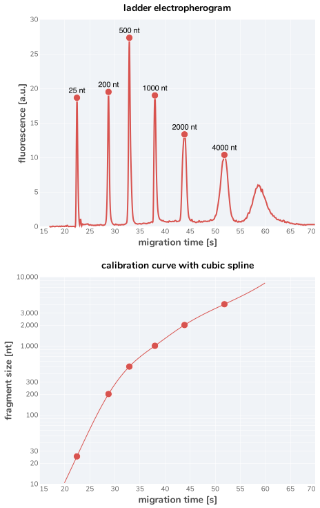

# 2021-02-25 Total RNA Extraction Dry Run

## Purpose
This experiment was a dry-run pilot experiment to test our extraction method
of total RNA from the wild-type strain NCM3722 in permissive glucose growth
medium. To assess the quality of the resulting total RNA, we looked at the
fragment resolution on an Agligent Bioanalyzer 2100.

## Results Summary 
This was a successful pilot experiment demonstrating that I can successfully
extract total RNA from WT lab-strain *E. coli* with high integrity. 

The observed growth rate was λ ≈ 0.90 / hr, notably slower than the
"standard" growth rate of λ ≈ 0.94 / hr. This may be due to culturing 10 mL
in 30 mm diameter test tubes. Due to space constraints, the cultures were
grown in a "vertical" position rather than tilted as typically done for
smaller tube sizes. Future experiments should see if angled positioning of
the tubes is sufficient to make the growth rates more reproducible.

## Materials 
### Strains
In this experiment, we considered only one strain, the WT NC3722 *E. coli* used 
in myriad other experiments.

| **Strain** | **Genotype** | **Plasmid** | **Lab Strain ID** | **Location** |
| :--: | :--: | :--: | :--: | :--: |
| NCM3722 *E. coli* | -- | -- | `GE046` | `GE Box 1, Pos 46` |

### Growth Medium
This experiment was conducted in our standard `N-C-` Base Buffer supplemented
with Glucose, Nitrogen, and and Micronutrients. See `/miscellaneous/media_recipes.md` 
for information about the `N-C-` medium composition.

|**Chemical Species** | **Function** | **Concentration** |
|:--|:--|:--|
|N-C- Buffer Base | pH Buffering and osmolarity | 1X |
|Micronutrients | Trace metals to support growth | 1X |
| Glucose | Carbon Source | 10 mM |
| Ammonium Chloride | Nitrogen Source | 10 mM|

## Results & Notes

### Growth Curve 

### Bioanalyzer Calibration

### Bioanalyzer Results

## Experimental Protocol
Bolded regions represent values for this particular experiment while non-bold
text corresponds to the standard protocol used for all similar experiments.

### Bacterial Growth

1. The previous day, a seed culture was prepared by picking 1 colony from an LB Miller  agarose plate and resuspending in 3 mL of LB Miller liquid medium. The seed culture was allowed to grow for 5 to 6 hours at 37° C with shaking until saturated. 
2. From the saturated culture, a dilution series was performed in the experimental growth medium to use as precultures for the actual experiment. A dilution series of 1:103, 1:104 and 1:105 was prepared via serial dilution. Precultures were placed in a 37° C water bath with aeration at 250 rpm at **≈ 10:30 pm** on 2021-02-24.
3. Around 11.5 hours later (**at ≈ 9:00 AM** on 2021-02-25), the **1:104** preculture reached an OD600nm of **≈ 0.4**. This preculture was diluted **≈ 1:30** into a **10 mL** of growth medium pre warmed to 37° C. The resulting OD600nm of this culture was **≈0.015**.
4. After dilution, measurements of optical density at 600 nm were made every 10 to 20 minutes. The density was recorded by hand into a paper notebook and later transferred to a CSV file. 

5. Once the OD600nm was **≈ 0.365**, the culture was harvested and total RNA was isolated as described below. 

6. Growth curve data was analyzed (see `growth_processing.py`) and a growth rate was estimated via MCMC implemented by the stan code (`code/stan/growth_rate_glm.stan`). 

### Total RNA Extraction
WIll be added soon. 